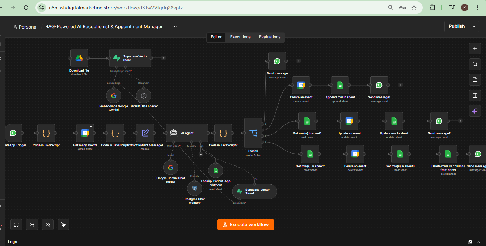

# 🏥 RAG-Powered AI Receptionist & Appointment Manager (n8n + WhatsApp + PostgreSQL)

> **An intelligent, production-ready healthcare automation workflow operating on WhatsApp. Features dynamic Google Calendar slot checking, PostgreSQL chat memory, and RAG-based clinic policy Retrieval for booking, rescheduling, and canceling appointments.**

---

### 🎥 Demonstration & Walkthrough
* 📺 **YouTube Video Walkthrough:** [Watch System Demo on YouTube](https://www.youtube.com/watch?v=NWUxiRPzk3A)
* 📄 **Workflow File:** `apt_RAG_workflow.json` *(Available in this folder)*
* 🖼️ **Architecture Diagram:** `apt_RAG_screenshot.PNG` *(Available in this folder)*

---

### 💡 The Problem
Medical practices face high volumes of repetitive inquiries, booking requests, and scheduling updates over WhatsApp. Standard chatbots lack context, offer conflicting time slots, or fail to handle rescheduling and cancellations gracefully, leading to patient frustration and staff overload.

### ⚙️ The Solution
This end-to-end n8n workflow acts as a 24/7 AI Receptionist over WhatsApp. It proactively queries real-time calendar availability before offering appointment times, maintains long-term patient conversation context using PostgreSQL, and utilizes Retrieval-Augmented Generation (RAG) to accurately answer clinic policy questions.

---

### Key System Architecture & Features

* 📲 **Native WhatsApp Integration:** Directly engages patients in natural dialogue to book, reschedule, or cancel doctor appointments.
* 📅 **Proactive Slot Validation (Zero Conflicts):**
  * Automatically fetches booked time slots from **Google Calendar** for the next 3 days prior to offering availability.
  * Dynamically presents up to 4 open slots aligned with the patient's expressed date and time preferences without overlapping existing commitments.
* 🔄 **Bi-Directional Database & Calendar Sync:** Updates both **Google Calendar** events and **Google Sheets** patient logs simultaneously upon booking, modification, or cancellation.
* 🧠 **Persistent Chat Memory (PostgreSQL):** Utilizes PostgreSQL as a session store to retain conversation history and patient preferences across multiple interactions.
* 📚 **RAG-Powered Clinic Knowledge Base:** Leverages Vector Search / RAG to retrieve precise clinic procedures, fee schedules, and preparation guidelines when patients ask complex policy questions.

---

### 🛠️ Tech Stack & Integrations
* **Orchestration:** n8n
* **Messaging Channel:** WhatsApp Cloud API
* **AI Engine & RAG:** Google Gemini / Vector Embeddings
* **Memory Database:** PostgreSQL
* **Data & Calendar:** Google Calendar API, Google Sheets API

---

### 📷 Workflow Architecture

