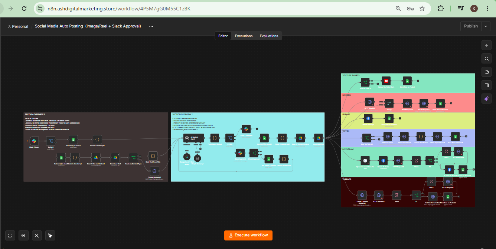

# 🚀 Multi-Platform Social Media Auto-Poster with AI & Human-in-the-Loop (n8n + Slack)

> **Production-grade n8n automation featuring an interactive Human-in-the-Loop (HITL) AI feedback loop that drafts, refines, and multi-publishes short-form video content across 6 major social platforms.**

---

### 🎥 Demonstration & Walkthrough
* 📺 **YouTube Video Walkthrough:** [Watch System Demo on YouTube](https://www.youtube.com/watch?v=wr5PwvKmwY4)
* 📄 **Workflow File:** `workflow.json` *(Available in this folder)*
* 🖼️ **Architecture Diagram:** `screenshot.png` *(Available in this folder)*

---

### 💡 The Problem
Managing short-form video distribution across multiple platforms is time-consuming and manual. Pure AI automation often fails because it lacks human oversight, leading to off-brand captions or posting errors.

### ⚙️ The Solution
This end-to-end n8n workflow bridges autonomous AI generation with strict human quality control. An AI agent creates tailored video captions and descriptions, routes them to **Slack** for interactive review, and only publishes once explicit approval is given.

---

### Key System Architecture & Features

* 🤖 **AI-Driven Drafting:** Automatically generates tailored captions, titles, and hashtags optimized for short-form content.
* 💬 **Interactive Slack Interface:** Uses dynamic Slack buttons and input fields to handle real-time approval or revision requests directly inside team channels.
* 🔄 **Dynamic AI Feedback Loop (Human-in-the-Loop):**
  * **If Approved:** Triggers instant multi-platform publishing.
  * **If Rejected:** The AI prompts the reviewer in Slack for specific feedback (e.g., *"Make it punchier"*, *"Rewrite caption for LinkedIn"*), regenerates the content dynamically, and requests re-approval.
* 🌐 **Simultaneous 6-Platform Distribution:**
  * ✅ **YouTube Shorts**
  * ✅ **LinkedIn**
  * ✅ **Threads**
  * ✅ **Facebook Page**
  * ✅ **Instagram Reels**
  * ✅ **TikTok**

---

### 🛠️ Tech Stack & Integrations
* **Orchestration:** n8n
* **Interactive Ops:** Slack API / Webhooks
* **AI Engine:** OpenAI / LLM Agents
* **Social APIs:** YouTube Data API, Meta Graph API (Facebook/Instagram/Threads), LinkedIn API, TikTok API

---

### 📷 Workflow Architecture

